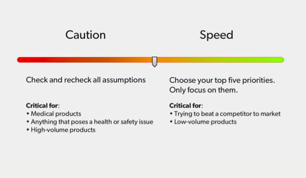
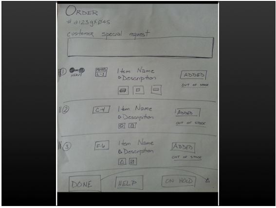

# Prototyping

### Why Prototype?
* Focus on the solution, not coding process
* Not limited to development concerns like integration, security, scalability,
etc.
* It is easier to run through design ideas if everyone can see how things might work with their own eyes
* People are often intimidated to “imagine” working features from a static page
* You can write fewer specifications for an interactive prototype than a set of static wireframes or mock-ups
* It is easier to carry out usability testing with a prototype compared to static images and in general get lots of juicy feedback from users

## Prototype !== MVP

The fidelity of the prototype should match the progress of the project. Early ideas should be displayed low fidelity with more details shown as project matures.

## Rapid Prototyping
The fastest, least time and least resource wasting option that best communicates your product at that point in time. Is a simple page-to-page click-thru enough or do you need an interactive prototype.
* Fast
* Efficient
* Enough

Data - complex enough to test before investing in building database. Prototype with a mock database or spreadsheet.

### Prototype Scope
1. What needs to be prototyped?
2. How much should be prototyped?
3. What’s the story?(tasks)
4. What’s the right level of fidelity?
5. What tool(s)work for this level?
6. What resources are necessary for this level?

[Six Steps To Superior Product Prototyping - Lessons from an Apple and Oculus Engineer](http://firstround.com/review/six-steps-to-superior-product-prototyping-lessons-from-an-apple-and-oculus-engineer/)

Map out your approach to prototyping by determining your point on a speed - caution slider. On one end is caution, and on the other end is speed.

**Porftolio tip** What are you comfortable with for your portfolio?
* Big, crazy ideas that may not work but demonstrate original thinking
* **OR** a well-planned, short yet successful and pre-determined schedule?

### Meet the needs with your prototype

[Video: Prototyping for Elmo’s Monster Maker iPhone App](https://vimeo.com/13377903)

## Practice Rapid Prototype

### Hawaii Panics After Alert About Incoming Missile Is Sent in Error
Jan 13, 2018. An early-morning emergency alert mistakenly warning of an incoming ballistic missile attack was dispatched to cellphones across Hawaii on Saturday, setting off widespread panic.

The alert went out at about 8:10 a.m., lighting up phones of people still in bed, having coffee by the beach at a Waikiki resort, or up for an early surf. “BALLISTIC MISSILE THREAT INBOUND TO HAWAII. SEEK IMMEDIATE SHELTER. THIS IS NOT A DRILL,” it read.

* Determine what we know?
* What is the purpose of the Missile Alert system.
* Is it a different system than a tsunami or volcano alert?
* Who operates the system?
* Was this human error? “Someone clicked the wrong thing on the computer,” Agency Spokesman.
* What is their `journey map`?
* How can this situation be avoided?

### Exercise
* Break into groups
* Spend 10 minutes deciding on key tasks/workflow to prototype
* Spend 30 minutes on a paper prototype of a new Warning System for Hawaii.
* Each group present their solution (max 15 minutes)

