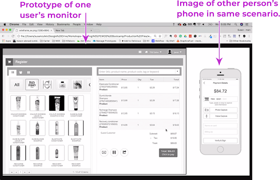

# Prototyping

* [Prototyping](Prototype.pdf)

## Watch and Read
* [10 Reasons for Wireframing](http://cornerstone-digital.com.au/blog/10-reasons-for-wireframing/#.XcRjZpJKjMK) [article – 3 min]
* [6 Tips How to Apply Information Architecture in UX Design](https://tubikstudio.com/6-tips-how-to-apply-information-architecture-in-ux-design/) [article — 6 min]
[Dashboard Design User Experience Guidelines](http://www.uxforthemasses.com/dashboard-design/) [article — 10 mins]

## Resources
* [Templates for web, mobile and tablet platforms](https://uiuxassets.com/assets/printable-wireframe-templates/)
* References - great for ANY interaction design (but especially apropos for the Hawaii Alert System
  * [UK Government Digital Service Design Principles](https://www.gov.uk/guidance/government-design-principles)
  * [U.S. Digital Services Playbook](https://playbook.cio.gov/)

## Practice
* Interactive Prototype the missile exercise using prototyping software
* **Wireframe:** Create a "Mid-Fidelity", B&W prototype that is interactive (i.e., when I click on a button, it should take me somewhere; when I click on a dropdown, I should see a list. If you are designing for a mobile phone, design for iPhone 7 dimensions. It is the most common size in use today.  For monitors, 1280px width is a good default.  You would probably know exactly what monitor size you are designing for in this scenario because it is for a limited number of employees on government issued devices; we're just using the most common screen dimensions for this exercise.)
* **An example:** [NourishWise Wireframes](https://eniat7.axshare.com/#g=1&p=text_reminder). Note - this prototype is inside a phone so that it could be projected. Normally I wouldn't have include the phone frame and just wireframed the contents so I could test and demonstrate the screens on an actual mobile phones.
* You are designing a solution that may affect multiple users at the same time. It is fine to prototype just one side of the scenario for this exercise. It is realistic for one person to prototype one user's view and a co-work to build the prototype of a different user's view. You would work together to be sure the two prototypes are in sync and work together, but to save time the task might be divided up.  For example, for Hawaii, your solution might have one  part that will be used by the person authorizing the alert and another sending out the alert.  You would work with your co-worker to sketch out  the key screens for both parties to be sure you capture the combined workflow, and then one of you would prototype the authorizer's app and the other would prototype the sender's app.
* An example, if your solution has one user sitting at a desk with a monitor and another out in the field on a mobile phone, you could create the interactive prototype of the monitor screen and display an image of the second user's phone next to it.  This is just an example, you do NOT have to build your prototype this way.

* Remember, your goal with any prototype is to communicate the solution you have come up with. Tell a good story with it. Focus on the key features. You aren't reinventing the operations. You aren't worried about branding.  The prototype is meant to communicate the idea so you can demonstrate it to decision makers, test it with users, and give it to developers to build the final solution.

### Stretch Goals
* High Fidelity prototype  with color, sounds, etc.
* Prototype both sides of the system — the alert sender (the one we're redesigning) and the person(s) that decides to send the alert
* Record the call that would play (over phone/speakers/...)

Consider the following
* Who is your user?
* What is their situation, their environment?
* What key insights have you learned to drive your design?
* For page layout - what patterns work best for this scenario?
  * Asymmetric layouts, for example, create tension and dynamism — not practical for every site, but works to drive the user to focus on a particular point on the screen without disrupting visual flow.
* Don't forget to use Visual Hierarchy.
